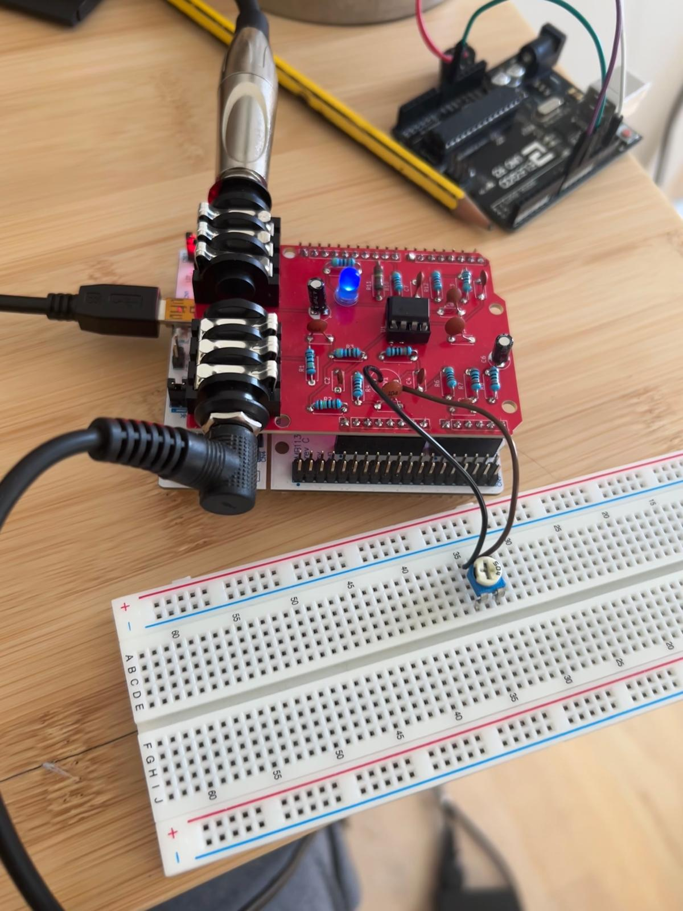
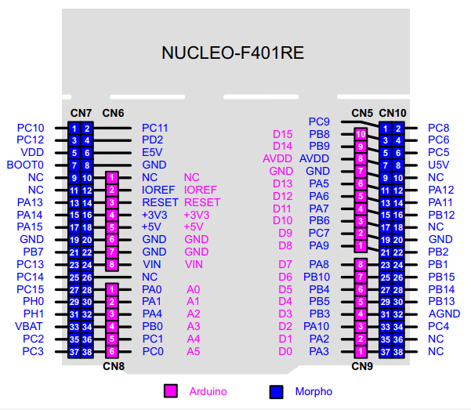

# Arduino Pedal Shield with a NUCLEO-F401RE 

Previously, I made my own PCB for the [Arduino Pedal Shild project](https://github.com/Guillermp/Modified-Arduino-Uno-Pedalshield) but found some limitations related to the memory of the Arduino UNO. This made me think I reached a dead end in the project. However, I came across the STM32 Nucleo boards and their compatibility with Arduino UNO shields. With more memory, I can implement memory-hungry effects, such as delay-based effects, giving me a solid test bed for developing real-time audio effects. :)

Figure 1: Picture of the working prototype.

---
Problem: the Arduino UNO has only 2Kb SRAM so I cannot really implement effects that require a substantial amount of memory such as delay based effects. 

Solution: using the NUCLEO-F401RE (96kb), and we can use the shield since it has an Arduino UNO compatible pin-out. Although we can't use the DAC which would improve the quality of the sound. :(

---
## Current Software

I'm planning to implement many different audio effects. For now I have implemented a very simple delay with feedback. 

https://github.com/user-attachments/assets/81fc5124-9ff0-4c79-a4c8-31b656073043

Audio 1: Delay demo.

---
## Pinout Mapping from Arduino UNO to NUCLEO-F401RE

Figure 2: Pinout mapping of the NUCLEO-F401RE.

- Input: A0
- Outputs (PWM): D9, D10

|             | Input                                      | Output 1 | Output 2 |
| ----------- | ------------------------------------------ | -------- | -------- |
| Arduino Uno | A0                                         | D9       | D10      |
| F401RE      | PA0                                        | PC7      | PB6      |
| Notes:      | (ADC1_IN0)                                 | TIM3_CH2 | TIM4_CH1 |

---

## Timer and PWM

I need to get a timer in the PWM phase correct mode (for stability)

And the input frequency should be the same as the output frequency: 32.81 kHz approx.
- So to get that frequency:
	- f_clock = 84MHz
	- Prescaler = 9
	- So we need to set the compare value (COMP) to COMP = 255

$$f_{timer} = \frac{f_{clock}}{(\text{Prescaler}+1)(\text{COMP}+1)}$$

to find the f_timer if we fix the f_clock and prescaler use:

$$COMP = \frac{f_{clock}}{(\text{Prescaler}+1)f_{timer}}-1$$

### Setting up the PWM outputs
- Issue: the outputs corresponding to D9 and D10 are on different timers. So we need to synchronize both timers (TIM3 = master timer  
TIM4 = slave timer)

## Reading from ADC

The adc should be triggered by the timer so that the input and output sample frequency are the same

## STM32 PedalShield Configuration Summary

I also made some screenshots of the from STM32 CubeMX saved in `\images_cubeMX` 

### ADC1 Configuration

| Item | Value / Setting | Purpose |
|---|---|---|
| ADC instance | ADC1 | Main ADC used for audio input |
| Input channel | IN0 / Channel 0 | Audio input on PA0 |
| GPIO pin | PA0 | Analog input pin |
| Resolution | 12 bits | ADC range 0–4095 |
| Data alignment | Right alignment | Standard 12-bit value in lower bits |
| Scan conversion mode | Disabled | Only one ADC channel is used |
| Continuous conversion mode | Disabled | ADC is triggered externally by timer |
| Number of conversions | 1 | One sample per trigger |
| External trigger source | Timer 3 Trigger Out event | TIM3 controls sampling rate |
| External trigger edge | Rising edge | ADC starts on TIM3 TRGO rising edge |
| Sampling time | 15 cycles | Safer than 3 cycles for audio input |
| ADC interrupt | Enabled | Allows `HAL_ADC_ConvCpltCallback()` to run |

---

### TIM3 Configuration

| Item | Value / Setting | Purpose |
|---|---|---|
| Timer | TIM3 | Master timer |
| Clock source | Internal clock | Timer runs from internal APB timer clock |
| Prescaler | 9 | Divides timer clock by 10 |
| Counter period / ARR | 255 | Gives 8-bit PWM resolution |
| Counter mode | Up | Counter counts from 0 to ARR |
| PWM channel | Channel 2 | PWM output on TIM3_CH2 |
| GPIO pin | PC7 | Shield PWM output 1 |
| PWM mode | PWM mode 1 | Standard PWM output |
| Initial pulse / CCR | 0 | Initial duty cycle is 0% |
| Output compare preload | Enabled | Safer PWM duty-cycle updates |
| TRGO event | Update Event | Generates ADC sampling trigger |
| Master/slave mode | Enabled | Allows TIM3 to act as master trigger |

---

### TIM4 Configuration

| Item | Value / Setting | Purpose |
|---|---|---|
| Timer | TIM4 | Slave PWM timer |
| Slave mode | Trigger Mode | TIM4 starts/synchronizes from TIM3 |
| Trigger source | ITR2 | Internal trigger from TIM3_TRGO |
| Prescaler | 9 | Same as TIM3 |
| Counter period / ARR | 255 | Same 8-bit PWM resolution as TIM3 |
| Counter mode | Up | Counter counts from 0 to ARR |
| PWM channel | Channel 1 | PWM output on TIM4_CH1 |
| GPIO pin | PB6 | Shield PWM output 2 |
| PWM mode | PWM mode 1 | Standard PWM output |
| Initial pulse / CCR | 0 | Initial duty cycle is 0% |
| Output compare preload | Enabled | Safer PWM duty-cycle updates |
| Master/slave mode | Enabled | Keeps timer synchronization logic active |

---

### GPIO Pin Mapping

| Function | STM32 Pin | Peripheral Function | Notes |
|---|---|---|---|
| Audio input | PA0 | ADC1_IN0 | Must be configured as analog input |
| PWM output 1 | PC7 | TIM3_CH2 | High byte / coarse PWM |
| PWM output 2 | PB6 | TIM4_CH1 | Low byte / fine PWM |
| Onboard LED | LD2 pin | GPIO output | Used for debug blinking |

---

